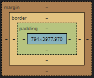

# Ingeniería en Sistemas Computacionales

## Programación Web

### Investigación de Modelo de caja y Display

**Alumno:** *Iván Rosales Cancino*

**No.Control:** *20100259*

**Docente:** *Ing.Gerardo Pineda Zapata*

***

### Modelo de caja

El modelo de cajas es el comportamiento de CSS que hace que todos los elementos de las páginas se representen mediante cajas rectangulares.

Las cajas de una página se crean automáticamente. Cada vez que se inserta una etiqueta HTML, se crea una nueva caja rectangular que encierra los contenidos de ese elemento.

En general, hay dos tipos de cajas: **cajas en bloque** y **cajas en línea**. Estas características se refieren al modo como se comporta la caja en términos de flujo de página y en relación con otras cajas de la página:

Si una caja se define como un bloque, se comportará de las maneras siguientes:

- La caja fuerza un salto de línea al llegar al final de la línea.
- La caja se extenderá en la dirección de la línea para llenar todo el espacio disponible que haya en su contenedor. En la mayoría de los casos, esto significa que la caja será tan ancha como su contenedor, y llenará el 100% del espacio disponible.
- Se respetan las propiedades width y height.
- El relleno, el margen y el borde mantienen a los otros elementos alejados de la caja.

Si una caja tiene una visualización externa de tipo inline, entonces:

- La caja no fuerza ningún salto de línea al llegar al final de la línea.
- Las propiedades width y height no se aplican.
- Se aplican relleno, margen y bordes verticales, pero no mantienen alejadas otras cajas en línea.
- Se aplican relleno, margen y bordes horizontales, y mantienen alejadas otras cajas en línea.

### Display

La propiedad CSS display especifica si un elemento es tratado como block or inline element y el diseño usado por sus hijos, como flow layout(Diseño de Flujo), grid(Cuadricula) o flex(Flexible).

Formalmente la propiedad display establece los tipos de visualización interna y externa de un elemento. La tipo externa establece la participacion de un elemento en flow layout; la tipo interna establece el layout(Diseño) de los hijos. Algunos valores de display estan totalmente definidos con sus especificaciones propias; por ejemplo el detalle de que pasa cuando display: flex es declarado y definido en la especificacion de Modelo Flexible de Caja(Flexible Box Model specification) de CSS.

### Valores
La propiedad display se especifica por medios de unas sintaxis o valores de palabras claves. Los valores de palabras clave se agrupan en seis categorías:

- < display-outside >
- < display-inside >
- < display-listitem >
- < display-internal >
- < display-box >
- < display-legacy >

En la actualidad, es mejor especificar display utilizando una sola palabra clave; aunque las últimas especificaciones permiten combinar algunas palabras clave, esto aún no está bien soportado por los navegadores.

## *Fuentes bibliograficas*
- https://developer.mozilla.org/es/docs/Learn/CSS/Building_blocks/The_box_model
- https://programacion1class.wordpress.com/3-5-modelo-de-caja/
- https://developer.mozilla.org/es/docs/Web/CSS/display#sobre_accesibilidad

## Link de mi GitHug

https://github.com/AjZiggler/IRosales.git